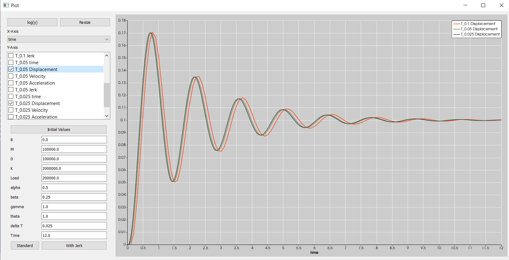

# TMC

 ------------------------------------------------------------------------------

 The magic code "TMC", stands also for testing my code.
 It includes a linear equation solver and two different initial value solver, which are used for two examples:

 1. The time dependent solution of an one dimensional FEM beam
    Here a generic approach is implemented, where you can tweak the variables to solve with different numerical approaches Linear acceleration, Newmark, Wilson-Theta, Generalized-alpha
    There are test functions to compare the three CSM Benchmarks proposed by [Turek & Hron](https://www.researchgate.net/publication/226447172_Proposal_for_Numerical_Benchmarking_of_Fluid-Structure_Interaction_Between_an_Elastic_Object_and_Laminar_Incompressible_Flow)

 2. The time dependent solution of a single mass oscilator
    this case is used to study the different behaviour of the initial value solver, the standard one based on the second order equation and the approach with the third derivative in the time equation.

Snapshot of the time series viewer

Project requirements
- Boost 1.78
- Qt 5.15.2
- Paraview 5.11 or VTK related
- MPI and TBB due to parallel Paraview compilation

Licensing
- GPLv3

Acknowledgements
- the logo was created with the [ASCII Text Signature Generator](https://www.kammerl.de/ascii/AsciiSignature.php)

